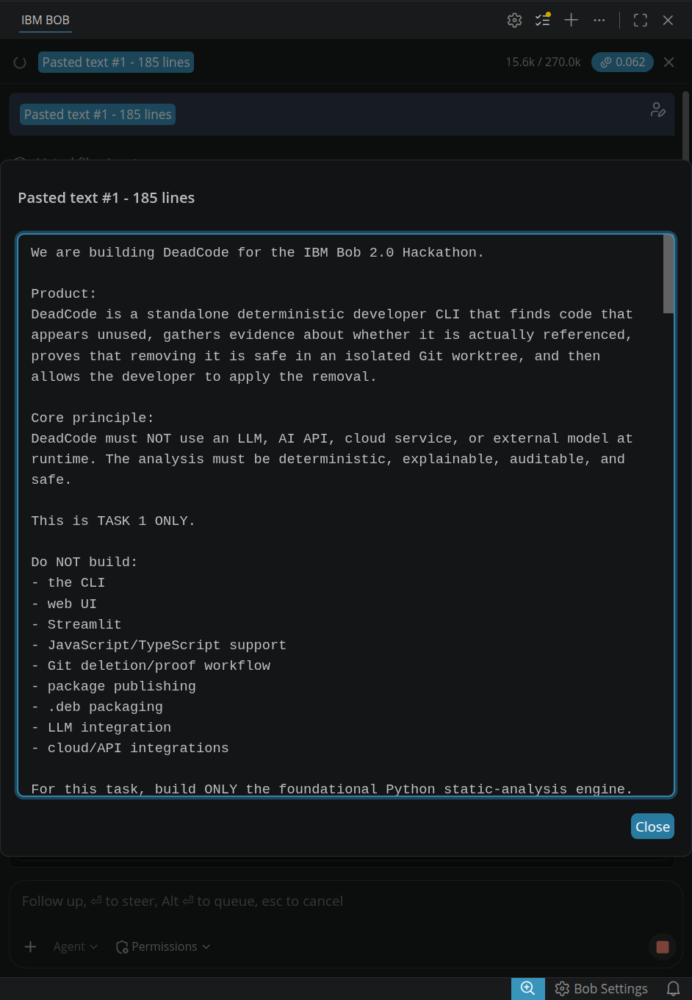
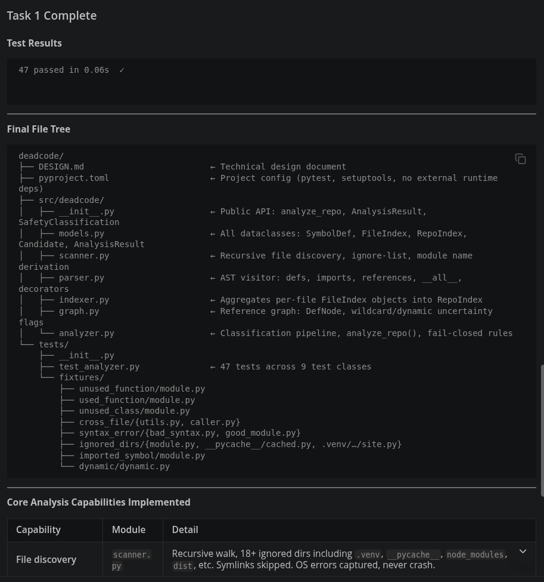
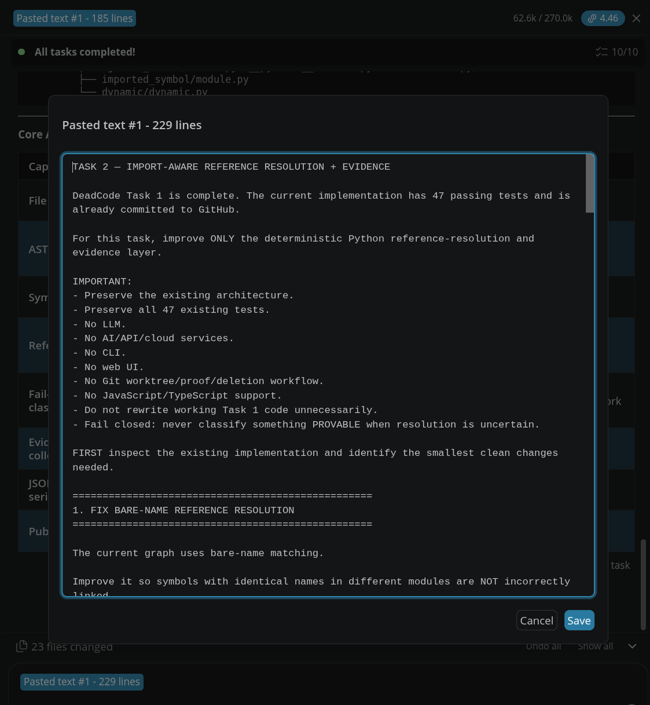
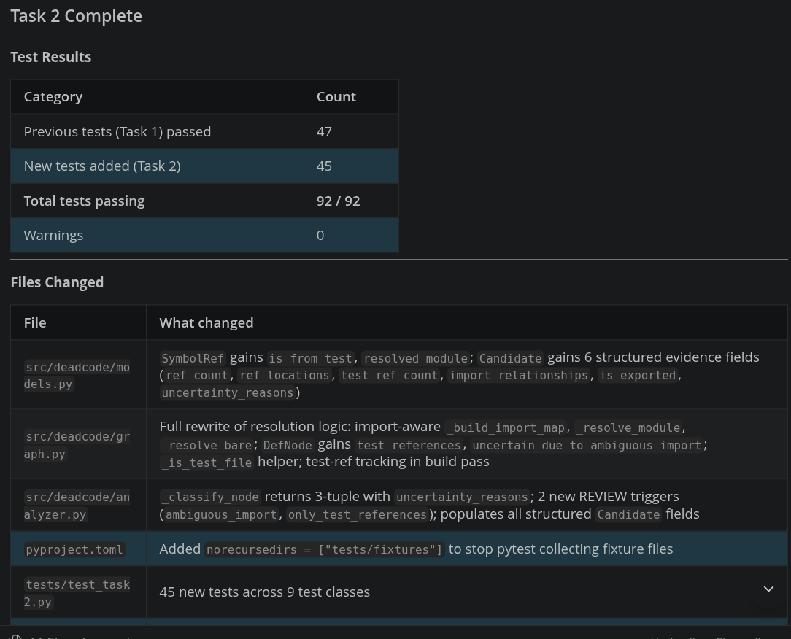
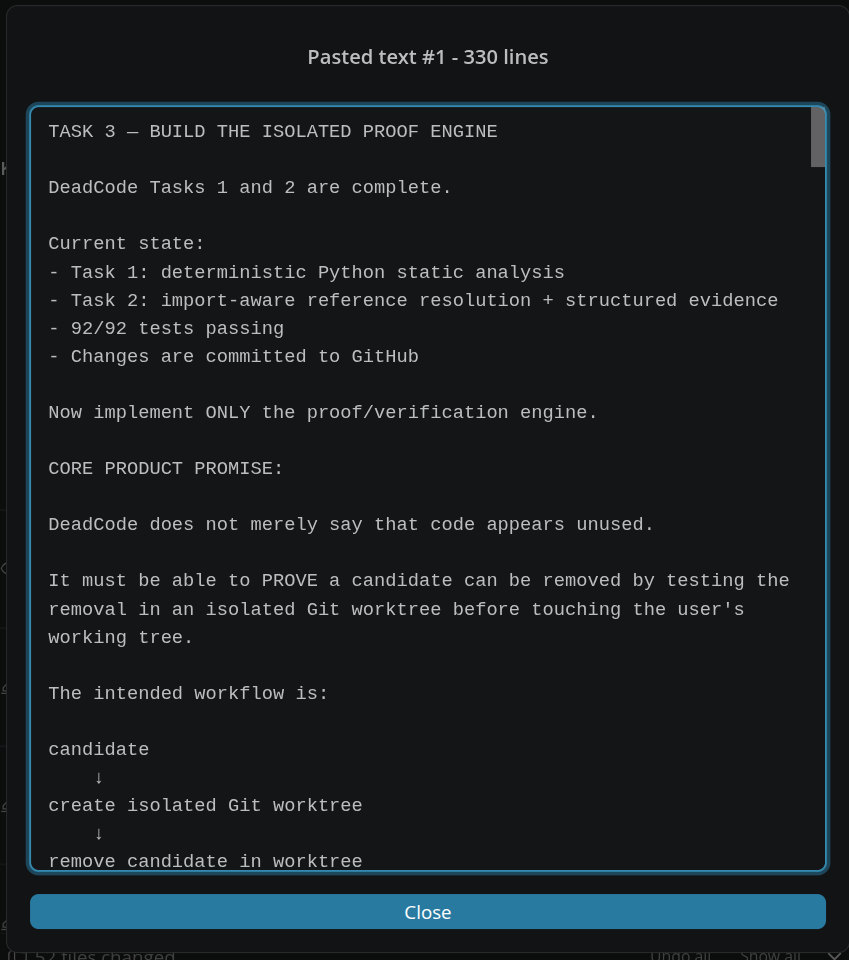
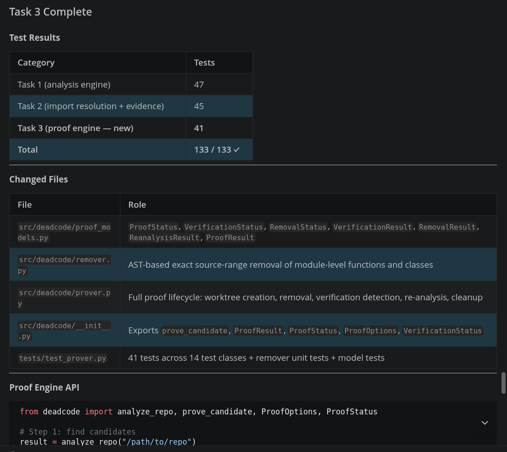
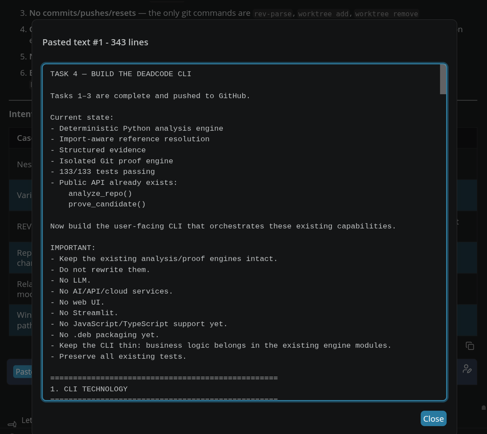
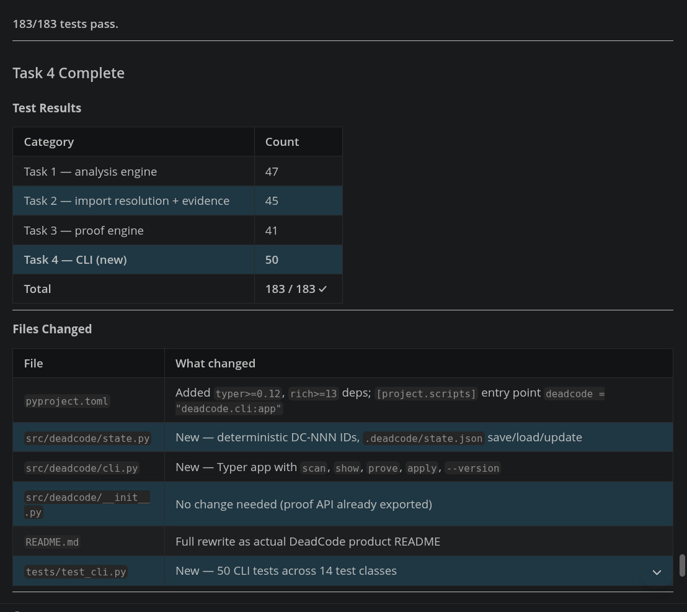

# IBM Bob 2.0 — Development Task Summaries

## DeadCode — Delete with evidence

DeadCode is a standalone deterministic developer CLI that finds code that appears unused, gathers evidence about whether it is actually referenced, proves that removing it is safe in an isolated Git worktree, and allows the developer to apply the verified removal.

**Core principle:** DeadCode does not use an LLM, AI API, cloud service, or external model at runtime. Its analysis is deterministic, explainable, auditable, and fail-closed.

---

## Task 1 — Foundational Python Static Analysis Engine

### Objective

Build the foundational deterministic Python static-analysis engine using Python's standard-library AST module.

### IBM Bob contribution

- Recursive Python repository scanner.
- Python AST parsing and symbol indexing.
- Detection of modules, functions, classes, imports, assignments, references, and exports.
- Deterministic reference graph.
- Candidate detection with structured evidence.
- `PROVABLE`, `REVIEW`, and `ACTIVE` classifications.
- Fail-closed handling of dynamic imports, decorators, `__all__`, framework patterns, reflection, and other uncertain cases.
- JSON-serializable analysis results.
- Initial synthetic test repositories and technical design documentation.

### Result

**47 tests passed.**

### Bob Task Session Summary & Report

#### Session Summary


#### Task Report


---

## Task 2 — Import-Aware Reference Resolution & Evidence

### Objective

Improve deterministic reference resolution and provide structured evidence for every candidate.

### IBM Bob contribution

- Import-aware local symbol resolution.
- Correct handling of identical symbol names across modules.
- Support for local import patterns such as:
  - `from module import symbol`
  - `import module`
  - nested package imports
- Structured candidate evidence:
  - definition file
  - definition line
  - symbol type
  - reference count
  - reference locations
  - import relationships
  - test references
  - export status
  - uncertainty reasons
- Test-reference detection.
- `__all__` safety handling.
- Additional fail-closed handling for wildcard imports, dynamic imports, reflection, and ambiguous imports.
- 45 new tests and regression fixtures.

### Result

**92 / 92 tests passed.**

### Bob Task Session Summary & Report

#### Session Summary


#### Task Report


---

## Task 3 — Isolated Proof & Verification Engine

### Objective

Build the safety mechanism that proves a candidate can be removed without modifying the user's working tree.

### IBM Bob contribution

- Dedicated proof engine.
- Temporary isolated Git worktrees.
- AST-based exact source removal.
- Verification command detection.
- Support for available tests, type checking, and build/package verification.
- Structured verification results.
- Re-analysis after removal.
- Confirmation that the candidate no longer exists.
- Guaranteed worktree cleanup.
- Safe subprocess handling.
- Fail-safe error handling.

### Safety guarantees

- User's working tree is not modified during proof.
- No automatic commits or pushes.
- No branch resets.
- Proof occurs inside an isolated worktree.
- Worktree cleanup occurs after success, failure, or exception.
- `REVIEW` candidates cannot be proven.

### Result

**133 / 133 tests passed.**

### Bob Task Session Summary & Report

#### Session Summary


#### Task Report


---

## Task 4 — DeadCode CLI

### Objective

Turn the analysis and proof engines into a usable developer CLI.

### IBM Bob contribution

Implemented:

```bash
deadcode scan
deadcode show DC-001
deadcode prove DC-001
deadcode apply DC-001
```

- Complete command-line interface using Typer and Rich.
- Formatted terminal output with styled tables, panels, and live progress spinners.
- Deterministic candidate ID assignment (`DC-001`, `DC-002`, ...).
- Proof and removal workflow integration.
- Interactive user confirmation for `deadcode apply` with `--yes` non-interactive override.
- Persistent scan and proof state tracking via `.deadcode/state.json`.
- Comprehensive CLI test suite with subprocess and isolation verification.

### Result

**183 / 183 tests passed.**

### Bob Task Session Summary & Report

#### Session Summary


#### Task Report


---

## Task 5 — Framework-Aware Safety Hardening & False-Positive Elimination

### Objective

Eliminate false positives caused by framework-driven implicit invocation (pytest discovery, AST visitor dispatch, framework base classes).

### IBM Bob contribution

- Detection of pytest test discovery conventions (`test_*` functions, `Test*` classes).
- Detection of AST visitor and transformer dispatch patterns (`visit_*`).
- Framework base-class tracking across AST scopes (`ast.NodeVisitor`, `ast.NodeTransformer`).
- Fail-closed escalation of convention-driven methods to `REVIEW` with clear uncertainty reasons.
- Dedicated safety regression test suite (`test_safety_hardening.py`).

### Result

**212 / 212 tests passed.**

---

## Task 6 — Python Module Dependency Analysis & Full File Removal

### Objective

Expand analysis, proof, and removal from symbol-level functions/classes to full Python module files (`SymbolKind.MODULE`).

### IBM Bob contribution

- Bidirectional module dependency graph (`module_dependencies` and `incoming_module_dependencies`).
- Accurate relative and absolute Python import resolution.
- Fail-closed module safety classification with 11 `REVIEW` triggers (`__init__.py`, `__main__.py`, entrypoints, dynamic imports, etc.).
- Isolated Git worktree module file removal engine.
- Stale-proof candidate identity protection.
- Safe file deletion output distinction in CLI.

### Result

**257 / 257 tests passed.**

---

## Task 7 — Class Method Removal & Visual CLI Identity

### Objective

Support safe proof and removal of unused class methods, and add a polished branded visual introduction to the CLI.

### IBM Bob contribution

- Recursive AST class definition traversal for candidate method matching.
- Exact-range class method removal preserving surrounding indentation and class structure.
- Empty class body preservation (safely inserting `pass` when removing the only method).
- Pre-write in-memory AST syntax validation.
- Original DeadCode terminal ASCII branding (bracketed skull emblem and `#FF8066` coral styling).
- Responsive terminal width layout ($\ge 74$ columns side-by-side, $< 74$ columns stacked).
- Clean no-subcommand splash screen while keeping `--help`, `--version`, and subcommands strictly intact.

### Result

**268 / 268 tests passed.**
